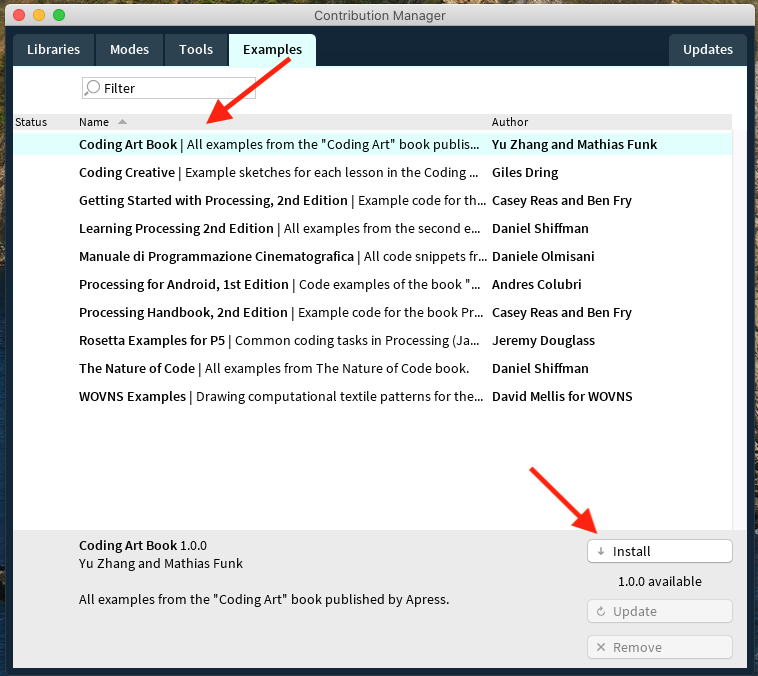
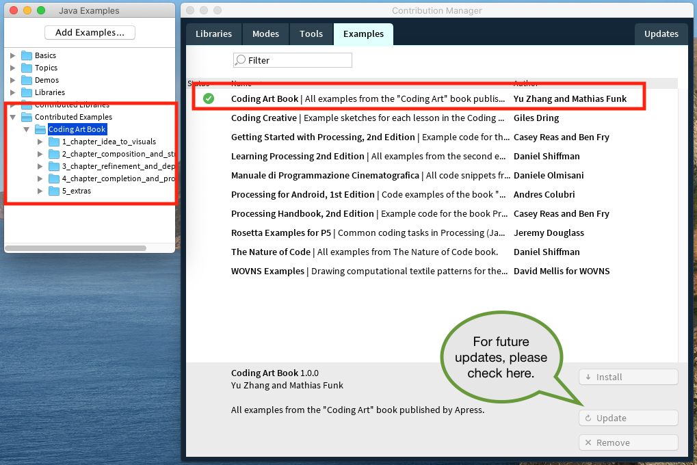

# Coding Art example library

This is the repository for all source code examples in the "Coding Art" book. We publish the code of all examples in the book organized by chapter and section. You can browse the examples by chapter here:

* Chapter [Idea to visuals](/examples/1_chapter_idea_to_visuals)
* Chapter [Composition and structure](/examples/2_chapter_composition_and_structure)
* Chapter [Refinement and depth](/examples/3_chapter_refinement_and_depth)
* Chapter [Completion and production](/examples/4_chapter_completion_and_production)
* Extras: [Miscellaneous code examples](/examples/5_extras)

**Let's install all examples as a Processing example library:**

## First things first: installing Processing

You need the [Processing](https://processing.org) coding environment to use the "Coding Art" examples. No problem, you can download it [here](https://processing.org/download). Installation should be quick and fast.

## How to easy-install the example library

The easiest and fastest way to get the book examples into your Processing environment is by using the _Processing Library Manager_. Here is the picture-perfect walk-through on macOS (Windows and Linux should work in a similar way):

Open Processing and the Examples box (File >> Examples...). In the examples box, click the button "Add examples..." at the top.

A new window opens with an overview of the available example libraries. Either search the list or enter "Coding Art" in the search box. Click the example in the results and then the button "Install". Done.

After a short moment, the example should be installed and become available in the examples box on the left side. The examples manager shows a green checkmark to indicate that the library was installed successfully.

We will update the library in the future, so you can get the latest version by clicking the "Update" button.

## How to manually install the example library

Download the [library archive](https://codingart-book.github.io/examples/CodingArtBookExamples.zip) and unpack it into the Processing examples folder on your computer. This folder is usually located in your home directory and contains subfolders such as examples, libraries, tools etc.

__Quick check:__ After this step, your Processing libraries folder should include a new folder "CodingArtBookExamples", which contains three files and the "examples" folder. All good? 🏄‍♂️

Then restart Processing and you should be able to see the book examples in the "Contributed Examples" folder of the Examples browser (open this from File >> Examples.. ).
